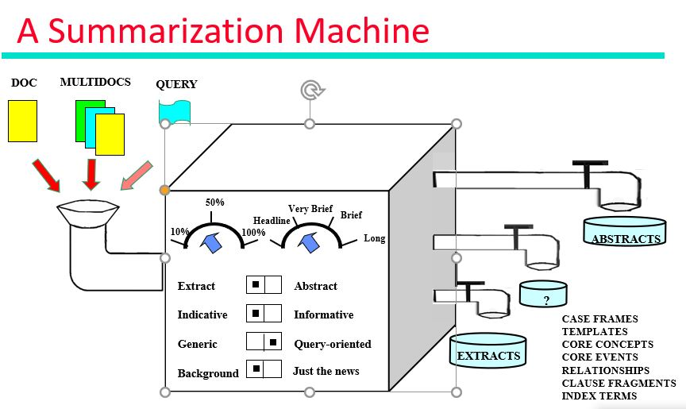
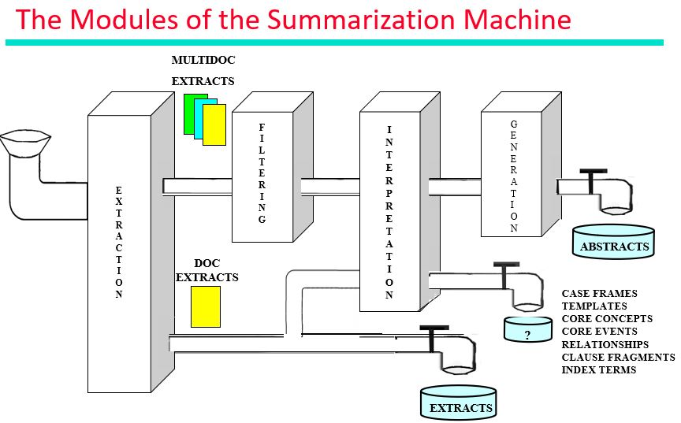

# Text Summarization
_Sequenece to Sequence Modelling_

**Attention Mechanism**

This is a NLP project for Text Summarization which is built with Flask(RESTapi) and deployed on Heroku(PaaS) using NLTK for summarizing text applied attention mechanism.

## Installation

Make sure you have [Python](http://www.python.org/) 3.6+ and
[pip](https://crate.io/packages/pip/)
([Windows](http://docs.python-guide.org/en/latest/starting/install/win/),
[Linux](http://docs.python-guide.org/en/latest/starting/install/linux/))
installed.

## If you like the repo please give a star, it motivates always !