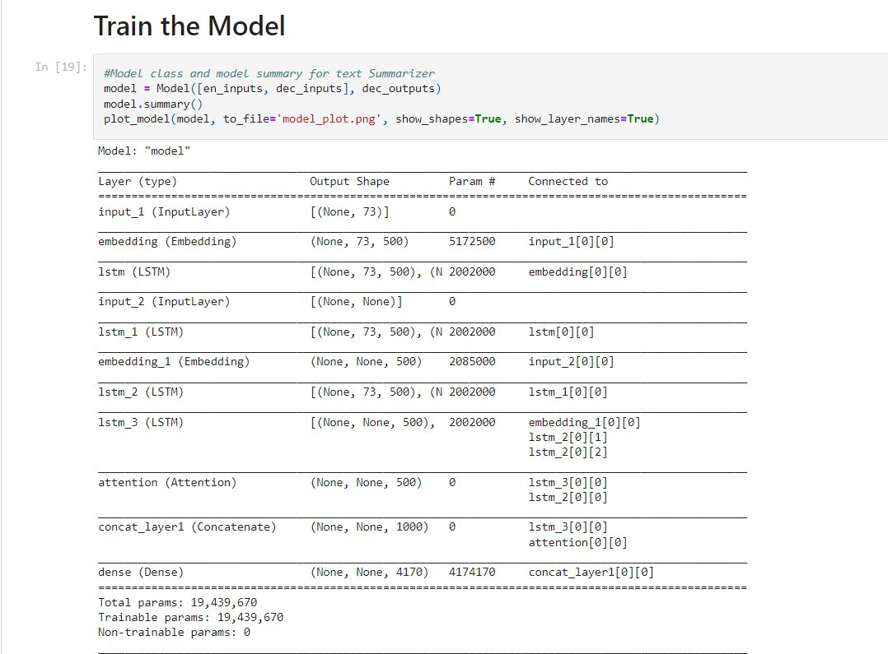
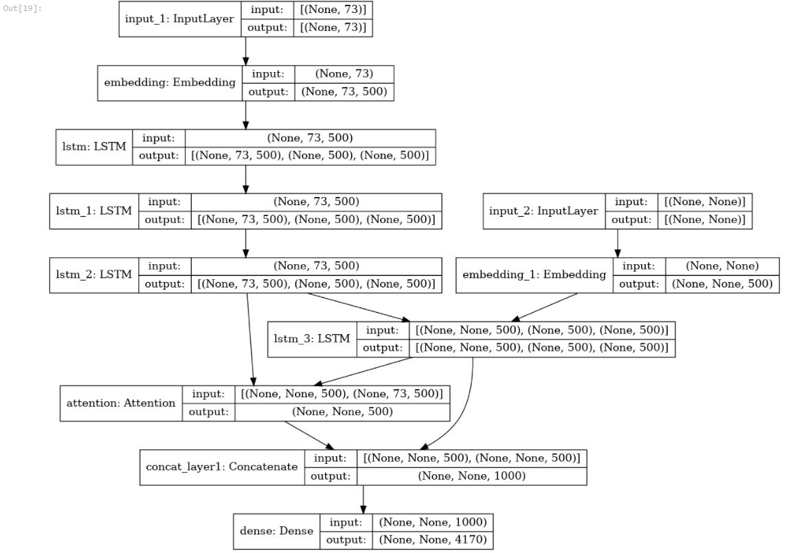
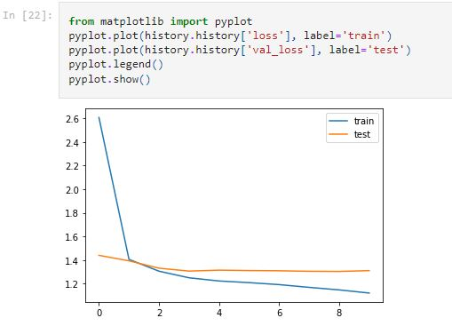

# Text Summarization
_Sequenece to Sequence Modelling_

**Attention Mechanism**

This is a NLP project for Text Summarization which is built with Flask(RESTapi) and deployed on Heroku(PaaS) using NLTK for summarizing text applied attention mechanism.

## Requirements :

- Flask==2.0.2
- h5py==3.1.0
- joblib==1.1.0
- keras==2.6.0
- Keras-Preprocessing==1.1.2
- matplotlib==3.3.4
- nltk==3.6.7
- numpy==1.19.5
- pandas==1.1.5
- scikit-learn==0.24.2
- scipy==1.5.4
- seaborn==0.11.2
- sklearn==0.0
- tensorboard==2.6.0
- tensorboard-data-server==0.6.1
- tensorflow==2.6.2
- tensorflow-estimator==2.6.0
- tokenizers==0.10.3

## Code Demo
### Model Training 

### Layer Architecture 

### Train & Test

## Installation

Make sure you have [Python](http://www.python.org/) 3.6+ and
[pip](https://crate.io/packages/pip/)
([Windows](http://docs.python-guide.org/en/latest/starting/install/win/),
[Linux](http://docs.python-guide.org/en/latest/starting/install/linux/))
installed.
__________________________________

________________________________________________

## References :
- https://link.springer.com/chapter/10.1007/978-3-030-30952-7_29
- https://towardsdatascience.com/lets-give-some-attention-to-summarising-texts-d0af2c4061d1
- https://web.stanford.edu/class/archive/cs/cs224n/cs224n.1174/reports/2749095.pdf
- https://iopscience.iop.org/article/10.1088/1742-6596/1848/1/012057/pdf
- https://medium.com/analytics-vidhya/seq2seq-abstractive-summarization-using-lstm-and-attention-mechanism-code-da2e9c439711
- https://www.hindawi.com/journals/mpe/2020/9365340/

_________________________________
## Final Note :
* <h3> Bug fixing, Code error or Anything Raise issue🤚. If it any have.</h3>
* <h3> Happy to hear your sugesstions🤝 about this project.</h3>
* <h3> Feel Free to Give ⭐ to this Repository.</h3>
* <h3> Thank you very much for visiting ❤️.</h3>
* <h3> Stay Safe✌️ and Stay Healthy✌️.</h3>