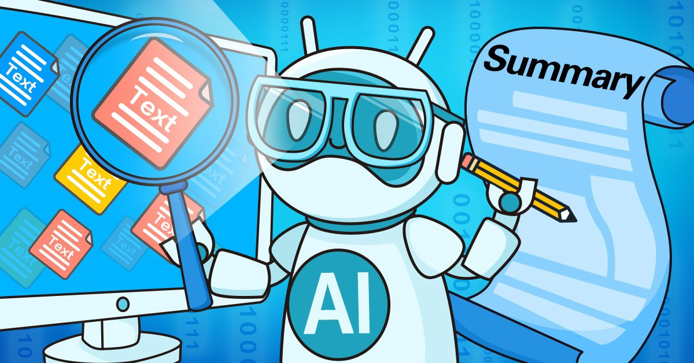

 <b> 
<u>
     Text Summarization </u>
  Sequenece to Sequence Modelling
     Attention Mechanism

## Installation

Make sure you have [Python](http://www.python.org/) 3.6+ and
[pip](https://crate.io/packages/pip/)
([Windows](http://docs.python-guide.org/en/latest/starting/install/win/),
[Linux](http://docs.python-guide.org/en/latest/starting/install/linux/))
installed.

